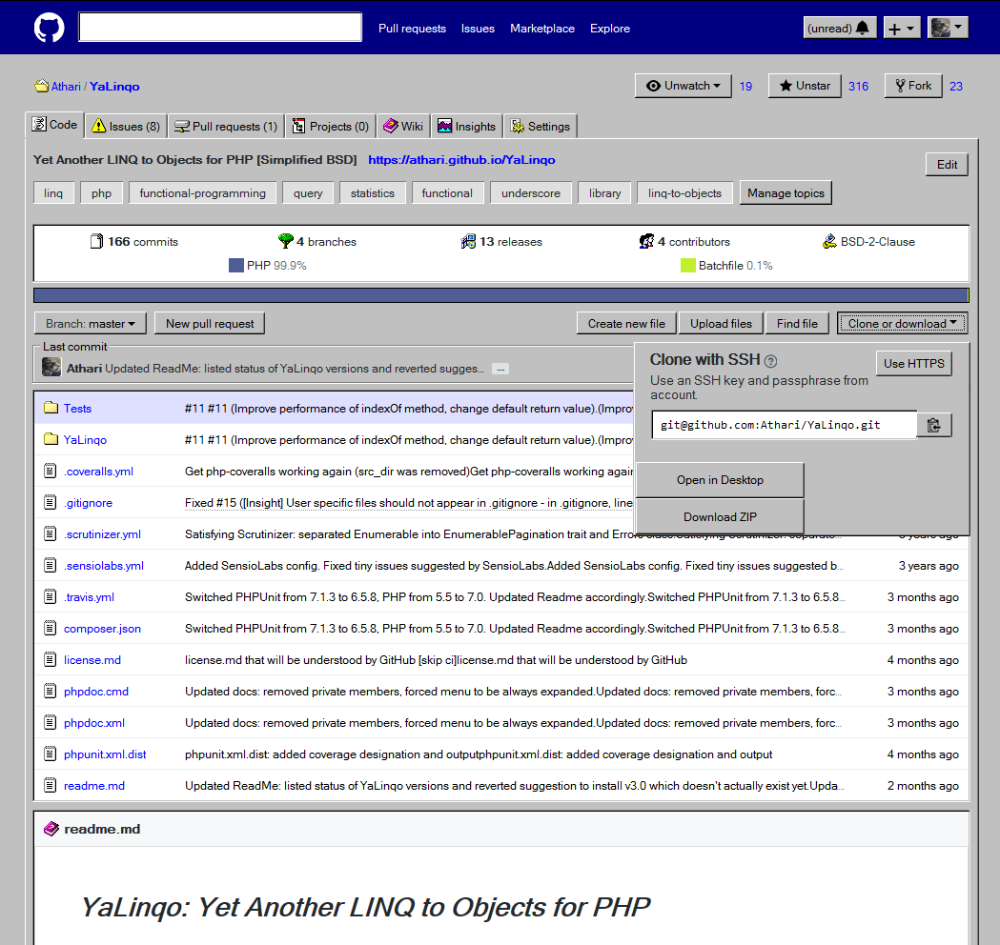
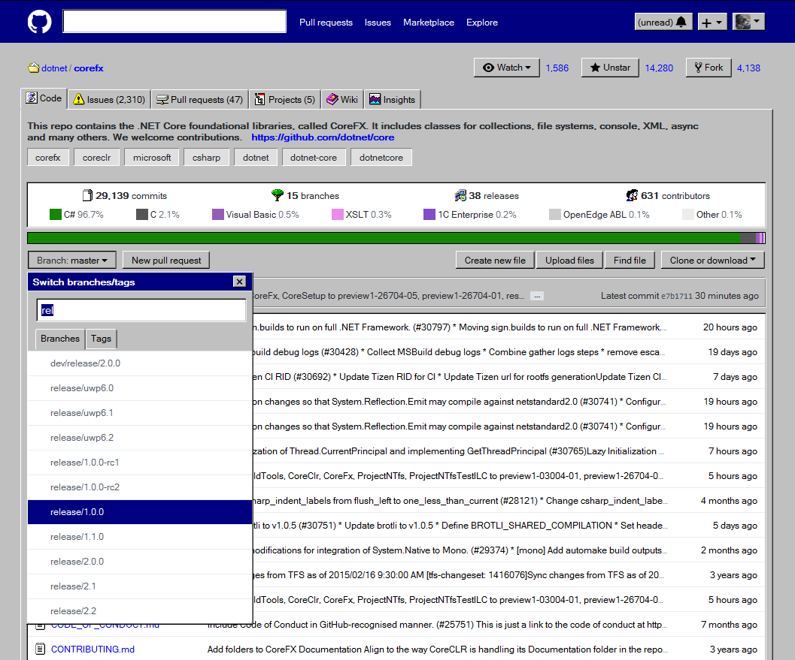

*GitHub Windows Edition: User style transforming GitHub into Windows 9x*
========================================================================

* [**GitHub repository**](https://github.com/Athari/CssGitHubWindows)

[][Install with Stylus]
[][Install with Stylish]
[][Install with TamperMonkey]

CssGitHubWindows is a user style which transforms GitHub's pages into a GUI resembling Windows 9x. All modern browsers should be supported.

NOTE: the style is in alpha development stage. Only some parts of the website have been fully transformed.

Screenshots
===========

Features
========

* Almost pixel-perfect reproduction of buttons, tabs, separators, groups, edit boxes, list boxes, tooltips, windows.
* Focus rectangles, text selection styles and other elements adjusted where possible.
* Some icons changed into icons from Windows 9x.
* Some UI has been transformed, for example repository stats are displayed as a shell list box and various group boxes have been titled.

Install
=======

If you're using **Firefox** or **Chrome**, you can use **Stylus** extension to apply the style. Stylus is free, open-source and the most feature-full extension.

**Stylish** is an older alternative which is no longer available, but it has been more popular. If you still have it installed, you can apply the user style using it, however you're strongly advised to migrate to Stylus as Stylish has been removed from browser extension stores for violating user privacy.

If you're using **Edge**, you can use **TamperMonkey** to install the user style as a user script.

If your browser is neither of the browsers mentioned above, please refer to online guides, it gets more complicated.

**Click on the extension title to see detailed instructions.**

<b>A. Firefox or Chrome: Stylus</b>

1. Add Stylus extension to your browser:

   * [Stylus for Firefox]
   * [Stylus for Chrome]

2. Add user style:

   * Open the [.user.css file][Install with Stylus].
   * Click the "Install Style" button in the opened window.

<b>B. Firefox or Chrome: Stylish</b>

**CAUTION:** Migrating to Stylus is strongly advised.

1. <s>Add Stylish extension to your browser:</s>

   * <s>Stylish for Firefox</s> (no longer available)
   * <s>Stylish for Chrome</s> (no longer available)

2. Add user style:

   * Visit the [style page on UserStyles.org][Install with Stylish].
   * Click the "Install with Stylish" button.

<b>C. Edge: TamperMonkey</b>

1. Add TamperMonkey extension to your browser:

   * [TamperMonkey for Edge]

2. Add user style:

   * Open the [.user.js file][Install with TamperMonkey] from the [style page on UserStyles.org][Install with Stylish].
   * Click the "Install" button.

Known issues
============

* Default margins of some controls like buttons has been changed. If GitHub uses pixel sizes for buttons, they may be cut off by a few pixels.
* Due to tooltips being children of controls, they change full control size, so focus borders may be displayed incorrectly.

License
=======
Licensed under the [MIT License](License.md).

Copyright (c) 2018 Alexander Prokhorov.

Links
=====

* **Tools:**

   * [Resource Hacker](http://www.angusj.com/resourcehacker/) — tool for extracting icons from executable files, including Windows 95 system files
   * [PNG optimizer](https://tinypng.com/) — online tool for optimizing PNG files
   * [Base64 encoder](https://www.base64-image.de/) — online tool for embedding images in CSS as data URIs

* **Browser extensions:**

   * [Stylus for Firefox] — extension for applying user styles for Firefox
   * [Stylus for Chrome] — extension for applying user styles for Chrome
   * [TamperMonkey for Edge] — extension for applying user scripts for Edge, which can be used to apply user styles too
   * <s>Stylish for Firefox — old extension for applying user styles for Firefox</s>
   * <s>Stylish for Chrome — old extension for applying user styles for Chrome</s>

* **Related:**

   * [Source of inspiration](https://twitter.com/nikitonsky/status/1003593821723267072) — post on Twitter
   * [Alternative style](https://userstyles.org/styles/160991/github-windows-classic) — style is simpler, but has retro aesthetic to it
   * [Another alternative style](https://github.com/3lo1i/WinHub-98) — closer to classic Windows theme than the previous one, but less complete

   [Install with Stylus]: https://raw.githubusercontent.com/Athari/CssGitHubWindows/master/GitHubWindows.user.css
   [Install with Stylish]: https://userstyles.org/styles/162167/github-windows-edition-ath
   [Install with TamperMonkey]: https://userstyles.org/styles/userjs/162167/github-windows-edition-ath.user.js
   [Stylus for Firefox]: https://addons.mozilla.org/en-US/firefox/addon/styl-us/
   [Stylus for Chrome]: https://chrome.google.com/webstore/detail/stylus/clngdbkpkpeebahjckkjfobafhncgmne
   [Stylish for Firefox]: https://addons.mozilla.org/en-US/firefox/addon/stylish/
   [Stylish for Chrome]: https://chrome.google.com/webstore/detail/stylish-custom-themes-for/fjnbnpbmkenffdnngjfgmeleoegfcffe
   [TamperMonkey for Edge]: https://www.microsoft.com/store/apps/9NBLGGH5162S
